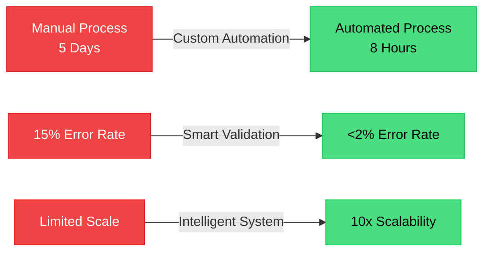

# 🚀 ERPNext Automation Expert Portfolio

<div align="center">


### **Transforming 5-Day Processes into 8-Hour Solutions**

*Real results from intelligent ERPNext implementation and custom automation workflows*


---

## 🛠️ Technology Stack

<div align="center">

| Core Platform | Development | Automation | Infrastructure |
|:---:|:---:|:---:|:---:|
|  |  |  |  |
|  |  |  |  |
|  |  |  |  |

</div>

---

## 📊 Real Results

<div align="center">

### **Measurable Impact on Business Operations**

</div>



<table>
<tr>
<th>Metric</th>
<th>Before</th>
<th>After</th>
<th>Improvement</th>
</tr>
<tr>
<td><strong>Month-End Closing</strong></td>
<td>5 Days (120 hours)</td>
<td>8 Hours</td>
<td><span style="color: #4ade80;">⬇️ 84% faster</span></td>
</tr>
<tr>
<td><strong>Error Rate</strong></td>
<td>15%</td>
<td>&lt;2%</td>
<td><span style="color: #4ade80;">⬇️ 87% reduction</span></td>
</tr>
<tr>
<td><strong>Processing Time</strong></td>
<td>Hours</td>
<td>Seconds</td>
<td><span style="color: #4ade80;">⚡ Real-time</span></td>
</tr>
<tr>
<td><strong>Scalability</strong></td>
<td>1x</td>
<td>10x</td>
<td><span style="color: #4ade80;">⬆️ 10x growth ready</span></td>
</tr>
<tr>
<td><strong>Operational Costs</strong></td>
<td>Baseline</td>
<td>-60-80%</td>
<td><span style="color: #4ade80;">💰 Major savings</span></td>
</tr>
</table>


---

</div>

## 🎯 The Challenge

<table>
<tr>
<td width="33%" align="center">

### ⏰ Time Waste
**5 Days** for month-end closing

Manual processes consuming valuable resources

</td>
<td width="33%" align="center">

### ❌ High Error Rate
**15%** error rate

Human mistakes costing money and trust

</td>
<td width="33%" align="center">

### 💸 Resource Drain
**Heavy overhead**

Inefficient operations limiting growth

</td>
</tr>
</table>

---

## ✨ The Transformation

<div align="center">

### **From Manual Chaos to Automated Excellence**

</div>

```
BEFORE                          AFTER
━━━━━━━━━━━━━━━━━━━━━━━━━━━━━━━━━━━━━━━━━━━━━━━━━━━━━
📅 5 Days Closing Time    →    ⚡ 8 Hours (84% faster)
❌ 15% Error Rate         →    ✅ <2% Error Rate
👥 Manual Operations      →    🤖 Intelligent Automation
💰 High Overhead          →    💎 60-80% Cost Reduction
📊 Batch Processing       →    ⚡ Real-time Processing
🐌 Limited Scalability    →    🚀 10x Growth Ready
```

---

## 🎨 Features

<table>
<tr>
<td>

### 🤖 **Intelligent Automation**
Custom workflows that transform manual processes into self-operating systems
- Zero manual data entry
- Automated validations
- Smart notifications

</td>
<td>

### ⚡ **Real-Time Processing**
From hours to seconds - instant data processing and decision making
- Live dashboards
- Instant reports
- Immediate insights

</td>
</tr>
<tr>
<td>

### 🎯 **Error Prevention**
Reduced human errors from 15% to less than 2% through automation
- Built-in validations
- Duplicate detection
- Data integrity checks

</td>
<td>

### 📈 **Scalable Growth**
Handle 10x business growth without proportional cost increase
- Cloud-ready infrastructure
- Modular architecture
- Performance optimized

</td>
</tr>
<tr>
<td>

### 💰 **Cost Optimization**
60-80% reduction in operational time and resource allocation
- Reduced labor costs
- Faster turnaround
- Better resource utilization

</td>
<td>

### 🔒 **Enterprise Security**
Bank-level security with role-based access and audit trails
- Multi-factor authentication
- Encrypted data
- Complete audit logs

</td>
</tr>
</table>

---

## 🏗️ Architecture Overview

```
┌─────────────────────────────────────────────────────────────┐
│                     INTELLIGENT AUTOMATION                   │
│                     ARCHITECTURE (IAA)                       │
└─────────────────────────────────────────────────────────────┘
                              │
              ┌───────────────┼───────────────┐
              │               │               │
     ┌────────▼────────┐ ┌───▼────┐ ┌───────▼────────┐
     │   ERPNext Core  │ │  n8n   │ │  Custom Apps   │
     │   - Accounting  │ │Workflow│ │  - Validators  │
     │   - Inventory   │ │ Engine │ │  - Integrations│
     │   - HR/Payroll  │ │        │ │  - Reports     │
     └────────┬────────┘ └───┬────┘ └───────┬────────┘
              │               │               │
              └───────────────┼───────────────┘
                              │
                    ┌─────────▼─────────┐
                    │  Real-time Data   │
                    │    Processing     │
                    └─────────┬─────────┘
                              │
              ┌───────────────┼───────────────┐
              │               │               │
     ┌────────▼────────┐ ┌───▼────┐ ┌───────▼────────┐
     │    Dashboards   │ │Reports │ │  Notifications │
     │   (Live Data)   │ │(Auto)  │ │   (Instant)    │
     └─────────────────┘ └────────┘ └────────────────┘
```

---

## 🚀 Getting Started

### Prerequisites

```bash
# System Requirements
- Python 3.8+
- Node.js 14+
- MariaDB/PostgreSQL
- Redis
- Docker (optional)
```

### Quick Installation

```bash
# Clone the repository
git clone https://github.com/yourusername/erpnext-portfolio.git
cd erpnext-portfolio

# Create virtual environment
python -m venv venv
source venv/bin/activate  # On Windows: venv\Scripts\activate

# Install dependencies
pip install -r requirements.txt

# Run the application
python app.py
```

### Docker Installation

```bash
# Using Docker Compose
docker-compose up -d

# Access the application
open http://localhost:5000
```

---

## 💼 Services Offered

<table>
<tr>
<td>

### 🎯 **ERPNext Implementation**
- Complete system setup
- Custom module development
- Data migration
- User training

</td>
<td>

### ⚙️ **Process Automation**
- Workflow design
- n8n integration
- API development
- Custom scripts

</td>
</tr>
<tr>
<td>

### 🔧 **System Optimization**
- Performance tuning
- Database optimization
- Code refactoring
- Security hardening

</td>
<td>

### 📊 **Business Intelligence**
- Custom dashboards
- Advanced reporting
- Real-time analytics
- KPI tracking

</td>
</tr>
</table>

---

## 🌍 Regional Expertise

<div align="center">

| Region | Experience | Industries |
|:---:|:---:|:---:|
| 🇪🇬 **Egypt** | 5+ Years | Manufacturing, Retail, Services |
| 🇸🇦 **Saudi Arabia** | 3+ Years | Oil & Gas, Healthcare, Logistics |
| 🇦🇪 **UAE** | 2+ Years | Trading, Real Estate, F&B |
| 🌎 **International** | Ongoing | Various sectors worldwide |

</div>

---

## 📈 Success Metrics

<div align="center">


</div>

### Key Performance Indicators

- ✅ **98%** Client Satisfaction Rate
- ✅ **50+** Successfully Delivered Projects
- ✅ **99.9%** System Uptime Guarantee
- ✅ **84%** Average Time Reduction
- ✅ **87%** Average Error Reduction
- ✅ **60-80%** Average Cost Savings

---

## 🎓 Expertise Areas

```python
expertise = {
    "ERP Systems": ["ERPNext", "Frappe Framework", "Custom Modules"],
    "Development": ["Python", "JavaScript", "Full-Stack Web"],
    "Automation": ["n8n", "Workflow Design", "Process Optimization"],
    "Integration": ["REST APIs", "Webhooks", "Third-party Services"],
    "Database": ["PostgreSQL", "MariaDB", "Query Optimization"],
    "DevOps": ["Docker", "CI/CD", "Cloud Deployment"],
    "Business": ["Process Analysis", "Requirements Gathering", "Training"]
}
```

---

## 📞 Let's Connect

<div align="center">

### **Ready to Transform Your Business Operations?**

Transform your month-end closing from 5 days to 8 hours with proven ERPNext expertise.

<br>

[](https://moh222salah.github.io/cv)
[](https://wa.me/201113903070)
[](mailto:your.email@example.com)

<br>

### **Available for:**

🔹 Full-time positions  
🔹 Freelance projects  
🔹 Consulting services  
🔹 Technical training  

</div>

---

## 🤝 Why Choose Me?

<table>
<tr>
<td width="50%">

### 💡 **Proven Track Record**
- Real results with measurable ROI
- 50+ successful implementations
- Clients across Egypt, Saudi Arabia, and Gulf
- 98% satisfaction rate

</td>
<td width="50%">

### 🎯 **Business-First Approach**
- Focus on solving real problems
- Understanding business needs
- Practical, scalable solutions
- Long-term partnership mindset

</td>
</tr>
<tr>
<td>

### 🔧 **Technical Excellence**
- Deep ERPNext expertise
- Custom development capabilities
- Modern development practices
- Continuous learning and adaptation

</td>
<td>

### 🌟 **Client Success**
- Dedicated support
- Comprehensive training
- Clear communication
- Timely delivery

</td>
</tr>
</table>

---

## 📝 Testimonials

> *"The transformation was incredible. What used to take us a week now takes less than a day. The automation has freed up our team to focus on strategic work rather than manual data entry."*
> 
> **— Finance Director, Manufacturing Company (Saudi Arabia)**

---

> *"Not just a developer, but a true business partner who understands our needs and delivers solutions that actually work in the real world."*
> 
> **— CEO, Trading Company (Egypt)**

---

## 📄 License

This portfolio website is open source and available under the [MIT License](LICENSE).

---

## 🙏 Acknowledgments

- ERPNext Community for the amazing platform
- Frappe Framework for the powerful foundation
- n8n for workflow automation capabilities
- All clients who trusted me with their digital transformation

---

<div align="center">

### **Building Tomorrow's Business Systems Today**

*Transforming businesses through intelligent automation and ERPNext excellence*

<br>

**© 2026 ERPNext Automation Expert. All rights reserved.**

<br>

[](https://github.com/yourusername)
[](https://python.org)
[](https://erpnext.com)

</div>
